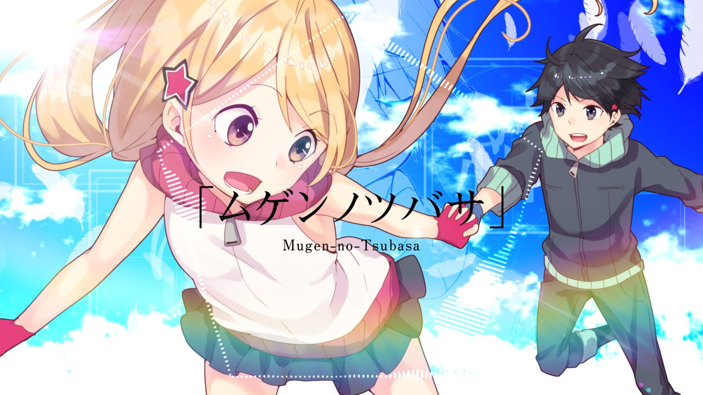
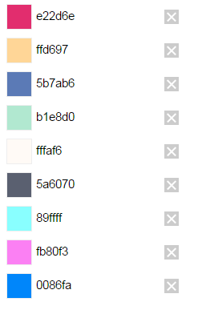

# ムゲンノツバサ

## 工程表
1. 絵コンテを動画化
2. 素材を配置して動画化
3. 尺に合わせて参考動画を切り貼り
4. イントロ粗出し
5. Aメロ粗出し
6. Bメロ粗出し
7. サビ粗出し
8. 間奏粗出し
9. 相談
10. イントロ詰め
11. Aメロ詰め
12. Bメロ詰め
13. サビ詰め
14. 間奏詰め
15. アウトロ詰め
16. カラコレ

**実際にはほとんどこれどおりにはいきませんでしたが。。。**

***

## 全体構想
* 空、機械、デジタル
* 漫画風味
* <b>ガリッッッガリ動かす</b>
* Aoさんの空使う
* 回路や電気のイメージ、光の線が流れていく感じ
* 絵は白黒、多少ベタ塗りとか必要かも？　＞　白黒フラット系のボカロを参考に
* ラスサビからフルカラー、線とかパーティクルとか増やす
* ラストさっぱり

## 色味

* 上6色はイラストで使われている色。赤がアクセント
* 青を中心にしつつ、ビビット系の黄色、ピンク、紫、青緑とかランダムに
* ~~全体に紙テクスチャ~~

***

